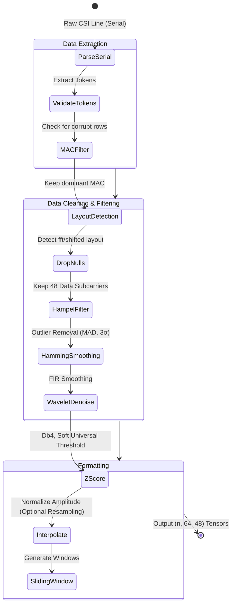

# CSI Data Preprocessing Pipeline

```mermaid
stateDiagram-v2
    [*] --> ParseSerial: Raw CSI Line (Serial)
    
    state "Data Extraction" as Extraction {
        ParseSerial --> ValidateTokens: Extract Tokens
        ValidateTokens --> MACFilter: Check for corrupt rows
        MACFilter --> LayoutDetection: Keep dominant MAC
    }
    
    state "Data Cleaning & Filtering" as DSP {
        LayoutDetection --> DropNulls: Detect fft/shifted layout
        DropNulls --> HampelFilter: Keep 48 Data Subcarriers
        HampelFilter --> HammingSmoothing: Outlier Removal (MAD, 3σ)
        HammingSmoothing --> WaveletDenoise: FIR Smoothing
        WaveletDenoise --> ZScore: Db4, Soft Universal Threshold
    }
    
    state "Formatting" as Format {
        ZScore --> Interpolate: Normalize Amplitude (Optional Resampling)
        Interpolate --> SlidingWindow: Generate Windows
    }
    
    Extraction --> DSP
    DSP --> Format
    Format --> [*]: Output (n, 64, 48) Tensors
```
