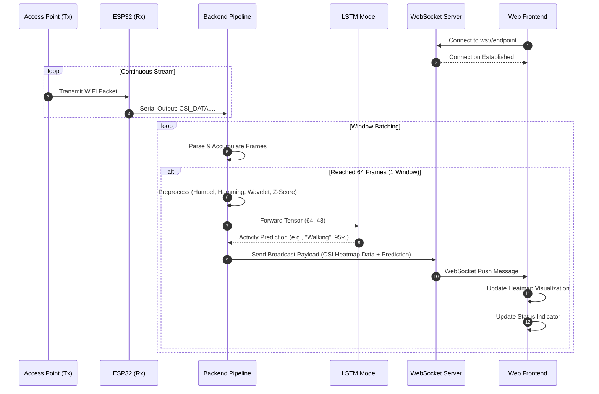

# Live Inference Sequence Diagram

```mermaid
sequenceDiagram
    autonumber
    
    participant AP as Access Point (Tx)
    participant ESP as ESP32 (Rx)
    participant BE as Backend Pipeline
    participant ML as LSTM Model
    participant API as WebSocket Server
    participant GUI as Web Frontend

    GUI->>API: Connect to ws://endpoint
    API-->>GUI: Connection Established
    
    loop Continuous Stream
        AP->>ESP: Transmit WiFi Packet
        ESP->>BE: Serial Output: CSI_DATA,...
    end

    loop Window Batching
        BE->>BE: Parse & Accumulate Frames
        alt Reached 64 Frames (1 Window)
            BE->>BE: Preprocess (Hampel, Hamming, Wavelet, Z-Score)
            BE->>ML: Forward Tensor (64, 48)
            ML-->>BE: Activity Prediction (e.g., "Walking", 95%)
            
            BE->>API: Send Broadcast Payload (CSI Heatmap Data + Prediction)
            API->>GUI: WebSocket Push Message
            
            GUI->>GUI: Update Heatmap Visualization
            GUI->>GUI: Update Status Indicator
        end
    end
```
